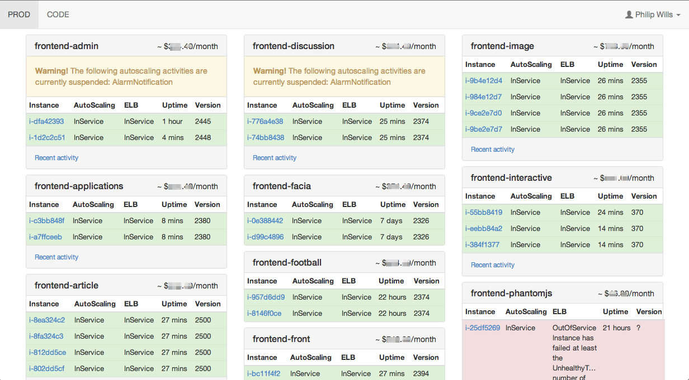
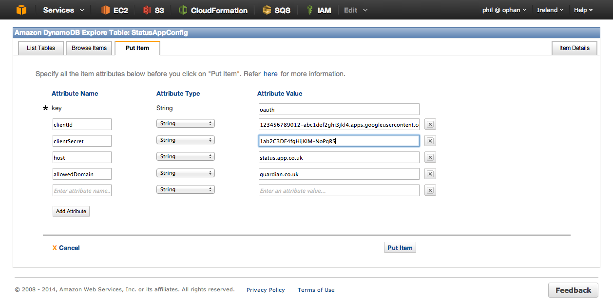

Guardian Status App
=====================================

Shows an overview of the status of autoscaling groups in an AWS account:

How do I run it?
----------------

There's a [Cloud Formation scripts](cloud-formation/status-app.json) template which does much of the work, but you'll 
need to put the [upstart config](status-app.conf) and the archive generated by running `sbt dist` into an S3 bucket 
called *stack*-dist in a directory /*stack*/*stage*/status-app/ where *stack* and *stage* are the corresponding names as passed to the Cloud Formation script.

If this is for a Guardian stack, open a pull request to include your stack in the [deploy.json](conf/deploy.json), so that you're always kept up to date with the latest version.

If you're tagging your auto-scaling groups according to the [Guardian conventions](https://github.com/guardian/prism/wiki/Tagging-conventions-for-AWS-and-Openstack), you should then
have something to see.

The Status App uses OAuth with Google as the provider for authentication. You'll need to
create client ID in the Google API console and then copy the details into the DynamoDB table
created by the CloudFormation scripts.

Ensure that you have switched on access to the Google+ API for your credentials.

For best results, you'll want to allow the security group created by the Cloud 
Formation script, called something like status-app-EC2SecurityGroup-XXXXXXXXXXXX, 
access to the management port of your apps.

Running locally
---------------

####Credentials

Credentials are retrieved from the configuration file used for the AWS CLI. For a Guardian stack, get your 
credentials via 'export to shell' in Janus as status-app doesn't currently handle AWS profiles.

#### Nginx setup

You'll need to perform the Nginx setup for 
[identity-platform](https://github.com/guardian/identity-platform/blob/master/nginx/README.md) 
first, before you do anything else.

##### Status-app specific setup
Update your hosts file

Add the following local development domain to your hosts file in /etc/hosts:

`127.0.0.1   status.thegulocal.com`

Run status-app's Nginx setup script
Run the status-app setup.sh script from the root of the support-frontend project:

`./nginx/setup.sh`

The script doesn't start Nginx. To manually start it run `sudo nginx` or `sudo systemctl start nginx` depending on your system.

#### Start the app
If you just want to run it locally, it's a standard [Play 2](http://www.playframework.com/) 
app and can be run with the 'run' command from an [SBT](http://www.scala-sbt.org/) prompt.

`sbt run` 

this defaults to port 9000

visit 

`https://status.thegulocal.com`

Contributing
------------

Pull requests are welcomed. If you hit a problem, or have an idea for improvments, 
open an issue, or let me know directly.

@philwills
